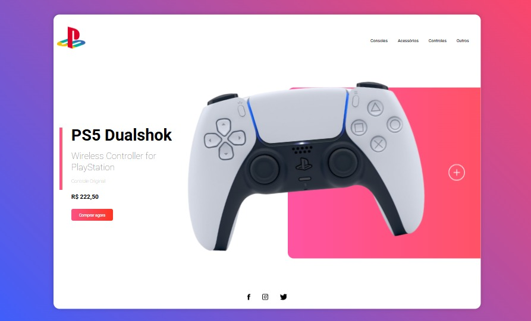

# 🎮 PlayStation – Site Inspirado

Projeto Front-End inspirado na identidade visual da PlayStation, desenvolvido com foco em interatividade, animações e responsividade.

## 🖥️ Demonstração
🔗 Site online: https://playstation-page.vercel.app/  
🔗 Repositório: https://github.com/mellacer/Playstation-Page

## 📸 Preview


## 🛠️ Tecnologias Utilizadas
- HTML5
- CSS3
- JavaScript

## ⚙️ Funcionalidades
- Interface inspirada no design da PlayStation
- Animação interativa do controle
- Menu de navegação com ícone hamburguer para dispositivos mobile
- Layout totalmente responsivo
- Interações visuais com JavaScript

## 📚 Objetivo do Projeto
Projeto desenvolvido com fins educacionais, com o objetivo de praticar:
- Criação de animações e interações com JavaScript
- Responsividade com CSS
- Implementação de menu hamburguer
- Organização de layout e hierarquia visual
- Integração entre HTML, CSS e JavaScript

## 📱 Responsividade
O layout foi adaptado para diferentes tamanhos de tela, garantindo boa experiência tanto em desktop quanto em dispositivos móveis.

## 🚀 Como executar o projeto
```bash
# Clone o repositório
git clone https://github.com/mellacer/Playstation-Page

# Acesse a pasta do projeto
cd Playstation-Page

# Abra o arquivo index.html no navegador
